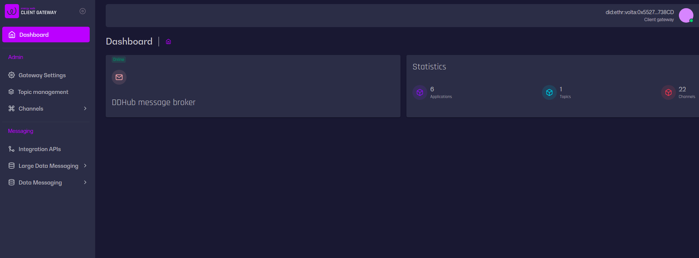

# DDHUB Client Gateway

DDHUB Client Gateway is a set of applications to communicate with [DDHUB Message Broker](https://github.com/energywebfoundation/ddhub-message-broker).  
This repository contains several applications.

### Frontend


This application allows us to configure client gateway backend

### API

Communicates directly with message broker for topics, messaging etc.

### Scheduler

Retrieves and caches data for performance purposes

## Environment variables

[API](docs/api-variables.md)  
[Frontend](docs/frontend-variables.md)
## How to run

After configuring environment variables (in `.env` file) run following commands

### Running migrations
Set environment variable `DB_NAME` as described in **Environment Variables** section

```shell
npm run migrations:build
npm run migrations:run
```

### Development mode

```shell
$ npm ci

$ nx serve dsb-client-gateway-scheduler
$ nx serve dsb-client-gateway-api
$ nx serve dsb-client-gateway-frontend
```

### Production mode

```shell
$ npm ci

$ nx build dsb-client-gateway-scheduler
$ nx build dsb-client-gateway-api

$ node dist/apps/dsb-client-gateway-api/main.js
$ node dist/apps/dsb-client-gateway-scheduler/main.js
```

Running pure `node` in production is not recommended. Use any process manager (pm2, docker etc.) for stability.  
You can find docker images in `ci` directory.  

For more details please refer to [Deployment Guide](https://energyweb.atlassian.net/wiki/spaces/AEMO/pages/3178627074/DDHub+Client+Deployment+Guide)

## Swagger
Swagger is available on route `{{API_HOST}}/docs`.    
Postman collection to import is available under `${{API_HOST}}/docs-json`

## Helpful links

- [HELM](https://github.com/energywebfoundation/dsb-client-gateway-helm)
- [Message Broker](https://github.com/energywebfoundation/ddhub-message-broker)

## Contributing
Pull requests are welcome. For major changes, please open an issue first to discuss what you would like to change.

Please make sure to update tests as appropriate.

## License
[MIT](https://choosealicense.com/licenses/mit/)
