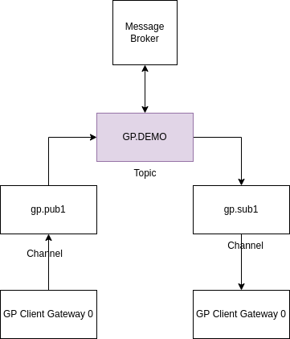

# Messaging


## 1. Communication overview


### Topics
Topics define shared communication channel for participants to communicate in standardized way. They are stored in Message Broker.

### Channels
Channel define internal rules of communication i.e. which topics can be used for particular channel, who can receive messages based on DID set or roles set.

## 0. Preconditions
1. Your Client Gateway needs to have configured private key,
2. Your private key needs to obtain a `user.roles` for namespace of application of Message Broker (i.e. `user.roles.ddhub.apps.szostak.iam.ewc`),
3. If you want to create topics you need to obtain role `topiccreator.roles`,
4. If you have env. variable `MTLS_ENABLED` set to `true` you need to upload certificates,

## 1. Topic configuration

To configure topic you need to make following request:  

```shell
curl --location --request POST 'http://localhost:3333/api/v2/topics' \
--header 'Content-Type: application/json' \
--data-raw '{
    "name":"GPDEMO1",
    "schemaType":"JSD7",
    "schema": "{\n   \"type\": \"object\",    \"properties\":{ \"data\":  {  \"type\": \"number\"\n} }  \n}",
    "version":"1.0.0",
    "owner":"dsb.apps.szostak.iam.ewc",
    "tags":["Test"]
}'
```

Remember to replace URL, `owner` and other properties to suit your needs/requirements.

## 2. Channel configuration

### Publish messages

```shell
curl --location --request POST 'http://localhost:3333/api/v2/channels' \
--header 'Content-Type: application/json' \
--data-raw '{
    "fqcn": "pub.gp1",
    "payloadEncryption": true,
    "type": "pub",
    "conditions": {
        "dids": [
            "did:ethr:volta:0x09Df5d33f1242E1b8aA5E0E0F6BfA687E6846993"
        ],
        "roles": [],
        "topics": [
            {
                "topicName": "GPDEMO1",
                "owner": "dsb.apps.szostak.iam.ewc"
            }
        ]
    }
}'
```

Remember to replace URL, `dids` and other properties to suit your needs/requirements.  

`conditions.dids` in case of `pub` channel type are telling you about "to who I want to send messages",
`conditions.roles` behaves in the same way as above expect it exchanges role for DIDs enrolled to this role.

### Get messages

```shell
{
    "fqcn": "sub.gp1",
    "payloadEncryption": true,
    "type": "sub",
    "conditions": {
        "dids": [
            "did:ethr:volta:0x09Df5d33f1242E1b8aA5E0E0F6BfA687E6846993"
        ],
        "roles": [],
        "topics": [
            {
                "topicName": "GPDEMO1",
                "owner": "dsb.apps.szostak.iam.ewc"
            }
        ]
    }
}
```

Remember to replace URL, `dids` and other properties to suit your needs/requirements.

`conditions.dids` in case of `sub` channel type are telling you about "from who I want to receive messages",
`conditions.roles` behaves in the same way as above expect it exchanges role for DIDs enrolled to this role.

## Sending a message

```shell
{
    "fqcn": "pub.gp1",
    "topicName": "GPDEMO1",
    "topicVersion": "1.0.0",
    "topicOwner": "dsb.apps.szostak.iam.ewc",
    "transactionId": "",
    "payload": "{ \"data\": 104 }"
}
```

Remember to replace URL, `topicOwner`, `topicName` and other properties to suit your needs/requirements.
This message will be sent to all DIDs who are specified either under by `dids' or `roles` in the channel configuration.

`topic*` properties describe a condition about source of messages (to which topic you want to send messages)

## Get messages

```shell
curl --location --request GET 'http://localhost:3333/api/v2/messages?fqcn=sub.gp1&amount=100&topicName=GPDEMO1&topicOwner=dsb.apps.szostak.iam.ewc&clientId=iam'
```````````

Remember to replace URL, `topicOwner`, `topicName` and other properties to suit your needs/requirements.
